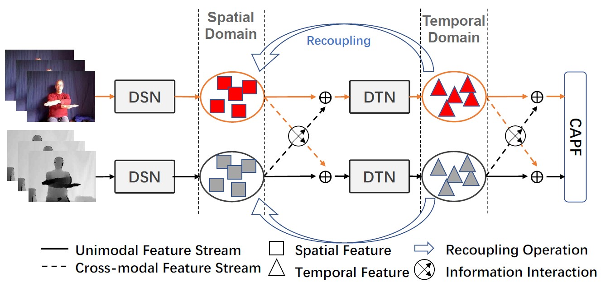
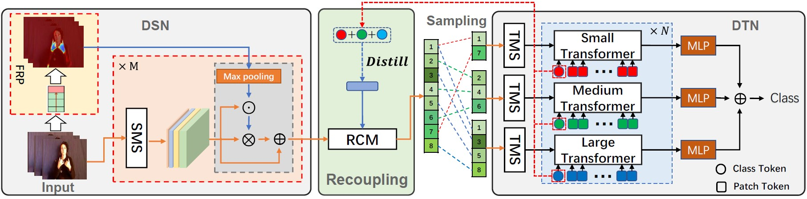

# [CVPR2022](https://openaccess.thecvf.com/content/CVPR2022/html/Zhou_Decoupling_and_Recoupling_Spatiotemporal_Representation_for_RGB-D-Based_Motion_Recognition_CVPR_2022_paper.html) Decoupling and Recoupling Spatiotemporal Representation for RGB-D-based Motion Recognition

[](https://paperswithcode.com/sota/hand-gesture-recognition-on-nvgesture-1?p=decoupling-and-recoupling-spatiotemporal)

This repo is the official implementation of "Decoupling and Recoupling Spatiotemporal Representation for RGB-D-based Motion Recognition" as well as the follow-ups. It currently includes code and models for the following tasks:
> **RGB-D-based Action Recognition**: Included in this repo.

> **RGB-D-based Gesture Recognition**: Included in this repo.

>**Dynamic motion attention capture based on native video frames**: Included in this repo. See FRP module in this paper.

## Updates
***27/07/2023***
 1. Updated the link of the journal expansion version [UMDR-Net](https://github.com/zhoubenjia/MotionRGBD-PAMI)(TPAMI'23) of this conference paper.
 2. Updated the link of its improved version [MFST](https://arxiv.org/pdf/2308.12006.pdf)(MM'23).

***27/10/2022***
 1. Update the code of NTU data preprocessing. 
 2. Fixed a bug in the DTN. 

***18/10/2022***
 1. Update the code of NvGesture training.

## 1. Requirements
This is a PyTorch implementation of our paper. 

torch>=1.7.0; torchvision>=0.8.0; Visdom(optional)

data prepare: Database with the following folder structure:

```
│NTURGBD/
├──dataset_splits/
│  ├── @CS
│  │   ├── train.txt
                video name               total frames    label
│  │   │    ├──S001C001P001R001A001_rgb      103          0 
│  │   │    ├──S001C001P001R001A004_rgb      99           3 
│  │   │    ├──...... 
│  │   ├── valid.txt
│  ├── @CV
│  │   ├── train.txt
│  │   ├── valid.txt
├──Images/
│  │   ├── S001C002P001R001A002_rgb
│  │   │   ├──000000.jpg
│  │   │   ├──000001.jpg
│  │   │   ├──......
├──nturgb+d_depth_masked/
│  │   ├── S001C002P001R001A002
│  │   │   ├──MDepth-00000000.png
│  │   │   ├──MDepth-00000001.png
│  │   │   ├──......
```
It is important to note that due to the RGB video resolution  in the NTU dataset is relatively high, so we are not directly to resize the image from the original resolution to 320x240, but first crop the object-centered ROI area (640x480), and then resize it to 320x240 for training and testing.

## 2. Methodology
<p align="center">
  
  
</p>
 We propose to decouple and recouple spatiotemporal representation for RGB-D-based motion recognition. The Figure in the first line illustrates the proposed multi-modal spatiotemporal representation learning framework. The RGB-D-based motion recognition can be described as spatiotemporal information decoupling modeling, compact representation recoupling learning, and cross-modal representation interactive learning. 
The Figure in the second line shows the process of decoupling and recoupling saptiotemporal representation of a unimodal data.

## 3. Train and Evaluate
All of our models are pre-trained on the [20BN Jester V1 dataset](https://www.kaggle.com/toxicmender/20bn-jester) and the pretrained model can be download [here](https://drive.google.com/drive/folders/1eBXED3uXlzBZzix7TvtDlJrZ3SlDCSF6?usp=sharing). Before cross-modal representation interactive learning, we first separately perform unimodal representation learning on RGB and depth data modalities. 
### Unimodal Training
Take training an RGB model with 8 GPUs on the NTU-RGBD dataset as an example,
some basic configuration:
```bash
common:
  dataset: NTU 
  batch_size: 6
  test_batch_size: 6
  num_workers: 6
  learning_rate: 0.01
  learning_rate_min: 0.00001
  momentum: 0.9
  weight_decay: 0.0003
  init_epochs: 0
  epochs: 100
  optim: SGD
  scheduler:
    name: cosin                     # Represent decayed learning rate with the cosine schedule
    warm_up_epochs: 3 
  loss:
    name: CE                        # cross entropy loss function
    labelsmooth: True
  MultiLoss: True                   # Enable multi-loss training strategy.
  loss_lamdb: [ 1, 0.5, 0.5, 0.5 ]  # The loss weight coefficient assigned for each sub-branch.
  distill: 1.                       # The loss weight coefficient assigned for distillation task.

model:
  Network: I3DWTrans                # I3DWTrans represent unimodal training, set FusionNet for multi-modal fusion training.
  sample_duration: 64               # Sampled frames in a video.
  sample_size: 224                  # The image is croped into 224x224.
  grad_clip: 5.
  SYNC_BN: 1                        # Utilize SyncBatchNorm.
  w: 10                             # Sliding window size.
  temper: 0.5                       # Distillation temperature setting.
  recoupling: True                  # Enable recoupling strategy during training.
  knn_attention: 0.7                # Hyperparameter used in k-NN attention: selecting Top-70% tokens.
  sharpness: True                   # Enable sharpness for each sub-branch's output.
  temp: [ 0.04, 0.07 ]              # Temperature parameter follows a cosine schedule from 0.04 to 0.07 during the training.
  frp: True                         # Enable FRP module.
  SEHeads: 1                        # Number of heads used in RCM module.
  N: 6                              # Number of Transformer blochs configured for each sub-branch.

dataset:
  type: M                           # M: RGB modality, K: Depth modality.
  flip: 0.5                         # Horizontal flip.
  rotated: 0.5                      # Horizontal rotation
  angle: (-10, 10)                  # Rotation angle
  Blur: False                       # Enable random blur operation for each video frame.
  resize: (320, 240)                # The input is spatially resized to 320x240 for NTU dataset.
  crop_size: 224                
  low_frames: 16                    # Number of frames sampled for small Transformer.       
  media_frames: 32                  # Number of frames sampled for medium Transformer.  
  high_frames: 48                   # Number of frames sampled for large Transformer.
```

```bash
bash run.sh tools/train.py config/NTU.yml 0,1,2,3,4,5,6,7 8
```
or
```bash
CUDA_VISIBLE_DEVICES=0,1,2,3,4,5,6,7 python -m torch.distributed.launch --nproc_per_node=8 --master_port=1234 train.py --config config/NTU.yml --nprocs 8  
```

### Cross-modal Representation Interactive Learning
Take training a fusion model with 8 GPUs on the NTU-RGBD dataset as an example.
```bash
bash run.sh tools/fusion.py config/NTU.yml 0,1,2,3,4,5,6,7 8
```
or
```bash
CUDA_VISIBLE_DEVICES=0,1,2,3,4,5,6,7 python -m torch.distributed.launch --nproc_per_node=8 --master_port=1234 tools/fusion.py --config config/NTU.yml --nprocs 8  
```

### Evaluation
```bash
CUDA_VISIBLE_DEVICES=0,1,2,3 python -m torch.distributed.launch --nproc_per_node=4 --master_port=1234 tools/train.py --config config/NTU.yml --nprocs 1 --eval_only --resume /path/to/model_best.pth.tar 
```

## 4. Models Download
<table>
  <tr>
    <th>Dataset</th>
    <th>Modality</th>
    <th>Accuracy</th>
    <th>Download</th>
  </tr>
  <tr>
    <td>NvGesture</td>
    <td>RGB</td>
    <td>89.58</td>
    <td><a href="https://drive.google.com/drive/folders/1jLAoMFkJ8-z3lyF0-mTvCuY8QchhiNOA?usp=sharing">Google Drive</a></td>
  </tr>
  <tr>
    <td>NvGesture</td>
    <td>Depth</td>
    <td>90.62</td>
    <td><a href="https://drive.google.com/drive/folders/1jLAoMFkJ8-z3lyF0-mTvCuY8QchhiNOA?usp=sharing">Google Drive</a></td>
  </tr>
  <tr>
    <td>NvGesture</td>
    <td>RGB-D</td>
    <td>91.70</td>
    <td><a href="https://drive.google.com/drive/folders/1jLAoMFkJ8-z3lyF0-mTvCuY8QchhiNOA?usp=sharing">Google Drive</a></td>
  </tr>
  
  <tr>
    <td>THU-READ</td>
    <td>RGB</td>
    <td>81.25</td>
    <td><a href="https://drive.google.com/drive/folders/1_oihwEN-AhhTvkmoTb5If6d1Hdf9Z5JC?usp=sharing">Google Drive</a></td>
  </tr>
  <tr>
    <td>THU-READ</td>
    <td>Depth</td>
    <td>77.92</td>
    <td><a href="https://drive.google.com/drive/folders/1_oihwEN-AhhTvkmoTb5If6d1Hdf9Z5JC?usp=sharing">Google Drive</a></td>
  </tr>
  <tr>
    <td>THU-READ</td>
    <td>RGB-D</td>
    <td>87.04</td>
    <td><a href="https://drive.google.com/drive/folders/1_oihwEN-AhhTvkmoTb5If6d1Hdf9Z5JC?usp=sharing">Google Drive</a></td>
  </tr>
  
   <tr>
    <td>NTU-RGBD(CS)</td>
    <td>RGB</td>
    <td>90.3</td>
    <td><a href="https://drive.google.com/drive/folders/1iMFsZA7X-8rIkafTIZT5Z0aEFvhT4pq6?usp=sharing">Google Drive</a></td>
  </tr>
    <tr>
    <td>NTU-RGBD(CS)</td>
    <td>Depth</td>
    <td>92.7</td>
    <td><a href="https://drive.google.com/drive/folders/1iMFsZA7X-8rIkafTIZT5Z0aEFvhT4pq6?usp=sharing">Google Drive</a></td>
  </tr>
  <tr>
    <td>NTU-RGBD(CS)</td>
    <td>RGB-D</td>
    <td>94.2</td>
    <td><a href="https://drive.google.com/drive/folders/1iMFsZA7X-8rIkafTIZT5Z0aEFvhT4pq6?usp=sharing">Google Drive</a></td>
  </tr>
  
  <tr>
    <td>NTU-RGBD(CV)</td>
    <td>RGB</td>
    <td>95.4</td>
    <td><a href="https://drive.google.com/drive/folders/1iMFsZA7X-8rIkafTIZT5Z0aEFvhT4pq6?usp=sharing">Google Drive</a></td>
  </tr>
    <tr>
    <td>NTU-RGBD(CV)</td>
    <td>Depth</td>
    <td>96.2</td>
    <td><a href="https://drive.google.com/drive/folders/1iMFsZA7X-8rIkafTIZT5Z0aEFvhT4pq6?usp=sharing">Google Drive</a></td>
  </tr>
    <tr>
    <td>NTU-RGBD(CV)</td>
    <td>RGB-D</td>
    <td>97.3</td>
    <td><a href="https://drive.google.com/drive/folders/1iMFsZA7X-8rIkafTIZT5Z0aEFvhT4pq6?usp=sharing">Google Drive</a></td>
  </tr>
  
  <tr>
    <td>IsoGD</td>
    <td>RGB</td>
    <td>60.87</td>
    <td><a href="https://drive.google.com/drive/folders/1oBSzhslRy34jqA-VsPFIYYCJfN8GdqED?usp=sharing">Google Drive</a></td>
  </tr>
  <tr>
    <td>IsoGD</td>
    <td>Depth</td>
    <td>60.17</td>
    <td><a href="https://drive.google.com/drive/folders/1oBSzhslRy34jqA-VsPFIYYCJfN8GdqED?usp=sharing">Google Drive</a></td>
  </tr>
  <tr>
    <td>IsoGD</td>
    <td>RGB-D</td>
    <td>66.79</td>
    <td><a href="https://drive.google.com/drive/folders/1oBSzhslRy34jqA-VsPFIYYCJfN8GdqED?usp=sharing">Google Drive</a></td>
  </tr>
</table>

# Citation
```
@InProceedings{Zhou_2022_CVPR,
    author    = {Zhou, Benjia and Wang, Pichao and Wan, Jun and Liang, Yanyan and Wang, Fan and Zhang, Du and Lei, Zhen and Li, Hao and Jin, Rong},
    title     = {Decoupling and Recoupling Spatiotemporal Representation for RGB-D-Based Motion Recognition},
    booktitle = {Proceedings of the IEEE/CVF Conference on Computer Vision and Pattern Recognition (CVPR)},
    month     = {June},
    year      = {2022},
    pages     = {20154-20163}
}
```
# LICENSE
The code is released under the MIT license.
# Copyright
Copyright (C) 2010-2021 Alibaba Group Holding Limited.
